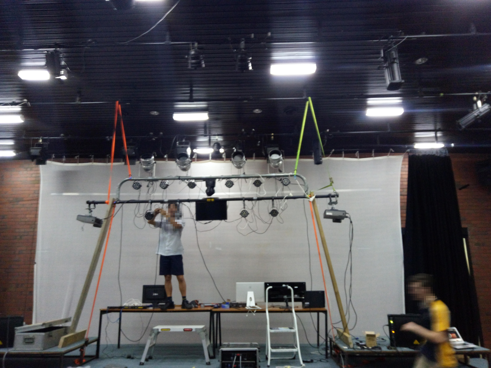
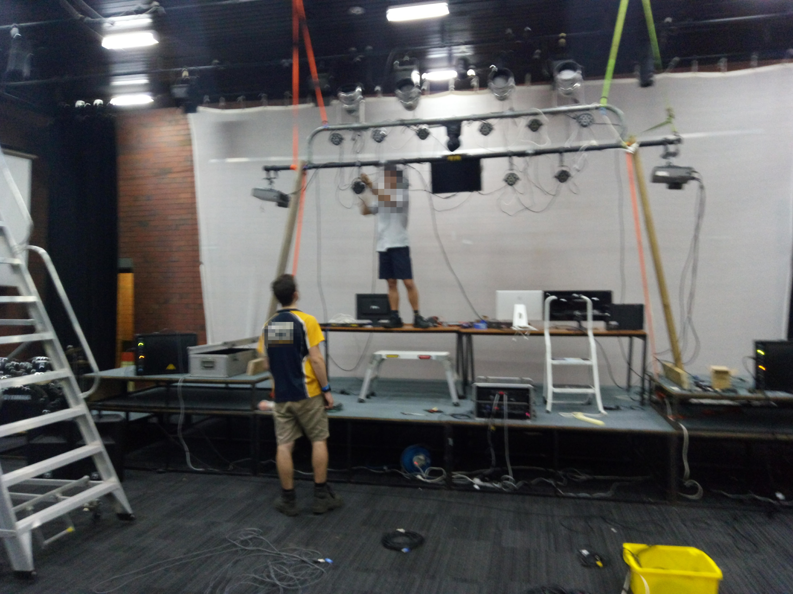
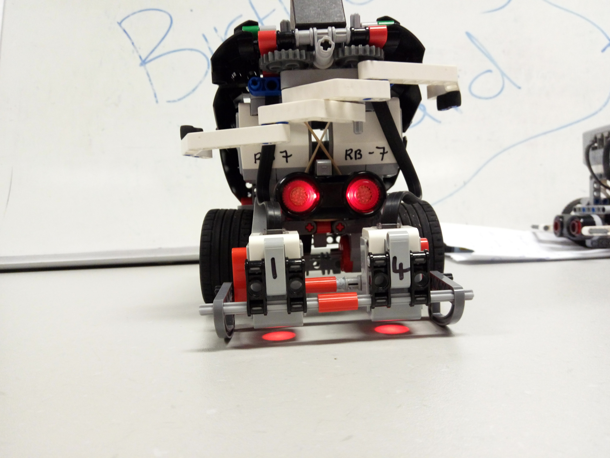



  &times;
  
  



This page shows the projects/events I have worked on. You can contact me to hire me if you want!
Click on any image to expand it.

# Programming
## [Mattrax](https://mattrax.otbeaumont.me)
I Am Currently Activly Developing Mattrax A Cross Platform MDM Server. It Is Build Using Go For The Backend With React For The Management Interface.
## [Github Resume](https://resume.github.io/?oscartbeaumont)
This Is My Resume Generated By Github From My Account.

# Sound and Lighting
## High School Music Production
I did lighting for a production of “High School Musical” at a small local theatre. I was using lighting desk shown below and all of the lights were analog and powered by 3 different 12 Channel Dimmers.


<table class="imgView">
  <tr>
    <td>
      
      
The View

    </td>
    <td>
      
      
The Lighting Desk

    </td>
    <td>
      
      
My Setup

    </td>
    <td>
      
      
The Cable Mess

    </td>
  </tr>
</table>


## Another School Social
A friend and I did sound and lighting for a school social event. The event was powered by an older sound and lighting desk. We used two T bars on both sides of the room to mount the lights on. We also used a projector already in the room to project cool graphics that changed based on the music.

 
 <table class="imgView">
   <tr>
     <td>
       
       
The Sound Setup

     </td>
     <td>
       
       
The Setup

     </td>
     <td>
       
       
The Lighting Desk

     </td>
   </tr>
 </table>
 

## Another School Social
A Friend and I ran sound and lighting for another social at school. It was held in an auditorium that already had lighting equipment so we ran two lighting “loops” both with different controllers. The existing lighting in the room was run off a [Smartfade ML](https://www.etcconnect.com/Products/Consoles/Smart-Family/SmartFade-ML/Features.aspx) and my friends custom built lighting bar and lights were powered by [QLC Plus](http://www.qlcplus.org/). The Sound was run using a [Si Expression](https://www.soundcraft.com/en-US/products/si-expression-1) and 4 [EV SX300's](https://www.electrovoice.com/product.php?id=202).


<table class="imgView">
  <tr>
    <td>
      
      
The Setup

    </td>
    <td>
      
      
The Lighting Bar 1

    </td>
    <td>
      
      
My Lighting Bar 2

    </td>
    <td>
      
      
Derigging The Lighting Bar

    </td>
    <td>
      
      
Packing And Sorting The Equipment

    </td>
  </tr>
</table>


# Robotics
## Robocup Australia Nationals
I was the captain of a Robotics team that entered [Robocup Nationals](http://www.robocupjunior.org.au/), a robotics competition that is held in Australia. My team came 6th. Our robots main problem was it getting “Stage Fright” and the colour sensors reading incorrectly. Our robot was built using the [Lego Mindstorms EV3](https://www.lego.com/mindstorms/about-ev3) Platform.


<table class="imgView">
  <tr>
    <td>
      
      
The Event

    </td>
    <td>
      
      
Front of The Robot

    </td>
    <td>
      
      
Side of The Robot

    </td>
    <td>
      
      
The Robot

    </td>
  </tr>
</table>

